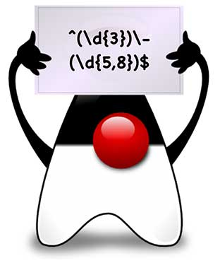

# 15 正则表达式

正则表达式是一种用来匹配字符串的强有力的武器。Java内置了强大的正则表达式的支持。

本章我们会详细介绍如何在Java程序中使用正则表达式。



## 正则表达式简介

在了解正则表达式之前，我们先看几个非常常见的问题：

- 如何判断字符串是否是有效的电话号码？例如：`010-1234567`，`123ABC456`，`13510001000`等；
- 如何判断字符串是否是有效的电子邮件地址？例如：`test@example.com`，`test#example`等；
- 如何判断字符串是否是有效的时间？例如：`12:34`，`09:60`，`99:99`等。

一种直观的想法是通过程序判断，这种方法需要为每种用例创建规则，然后用代码实现。下面是判断手机号的代码：

```java
boolean isValidMobileNumber(String s) {
    // 是否是11位？
    if (s.length() != 11) {
        return false;
    }
    // 每一位都是0~9：
    for (int i=0; i<s.length(); i++) {
        char c = s.charAt(i);
        if (c < '0' || c > '9') {
            return false;
        }
    }
    return true;
}
```

上述代码仅仅做了非常粗略的判断，并未考虑首位数字不能为0等更详细的情况。

除了判断手机号，我们还需要判断电子邮件地址、电话、邮编等等：

- boolean isValidMobileNumber(String s) { ... }
- boolean isValidEmail(String s) { ... }
- boolean isValidPhoneNumber(String s) { ... }
- boolean isValidZipCode(String s) { ... }
- ...

为每一种判断逻辑编写代码实在是太繁琐了。有没有更简单的方法？

有！用正则表达式！

正则表达式可以用字符串来描述规则，并用来匹配字符串。例如，判断手机号，我们用正则表达式`\d{11}`：

```java
boolean isValidMobileNumber(String s) {
    return s.matches("\\d{11}");
}
```

使用正则表达式的好处有哪些？一个正则表达式就是一个描述规则的字符串，所以，只需要编写正确的规则，我们就可以让正则表达式引擎去判断目标字符串是否符合规则。

正则表达式是一套标准，它可以用于任何语言。Java标准库的`java.util.regex`包内置了正则表达式引擎，在Java程序中使用正则表达式非常简单。

举个例子：要判断用户输入的年份是否是`20##`年，我们先写出规则如下：

一共有4个字符，分别是：`2`，`0`，`0~9`任意数字，`0~9`任意数字。

对应的正则表达式就是：`20\d\d`，其中`\d`表示任意一个数字。

把正则表达式转换为Java字符串就变成了`20\\d\\d`，注意Java字符串用`\\`表示`\`。

最后，用正则表达式匹配一个字符串的代码如下：

```java
// regex
public class Main {
    public static void main(String[] args) {
        String regex = "20\\d\\d";
        System.out.println("2019".matches(regex)); // true
        System.out.println("2100".matches(regex)); // false
    }
}
```

可见，使用正则表达式，不必编写复杂的代码来判断，只需给出一个字符串表达的正则规则即可。

### 小结
正则表达式是用字符串描述的一个匹配规则，使用正则表达式可以快速判断给定的字符串是否符合匹配规则。Java标准库`java.util.regex`内建了正则表达式引擎。